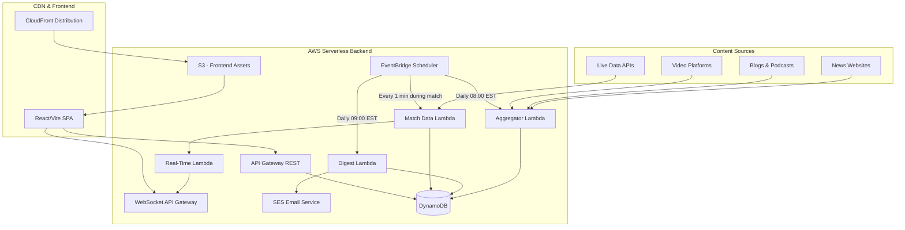
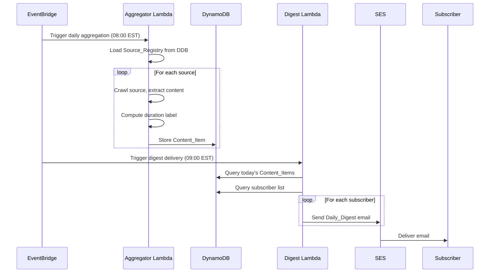
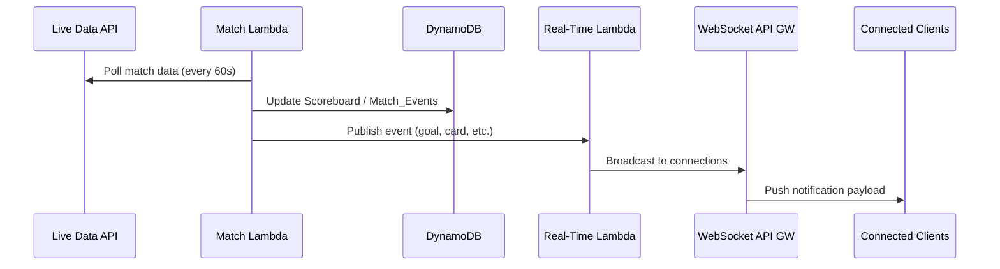
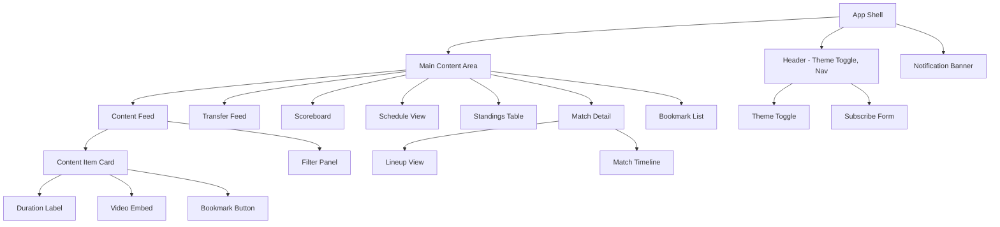

# Design Document: Arsenal News Aggregator

## Overview

The Arsenal News Aggregator is a serverless, event-driven platform that collects Arsenal FC news from global sources, curates daily digests, and delivers a rich real-time experience to fans. The system is composed of three primary layers:

1. **Aggregation Layer** — Scheduled Lambda functions crawl configured sources, extract content metadata, compute duration labels, and persist Content_Items to DynamoDB.
2. **Delivery Layer** — An EventBridge-triggered Lambda compiles the Daily_Digest and sends it to subscribers via SES at 09:00 EST.
3. **Presentation Layer** — A React/Vite SPA served from S3 + CloudFront, styled with USWDS, providing the content feed, live scoreboard, match timeline, standings, transfer feed, bookmarking, filtering, dark mode, and real-time notifications via WebSocket API Gateway.

All backend services are stateless AWS Lambda functions. DynamoDB serves as the primary data store. WebSocket API Gateway pushes real-time events (goals, breaking news) to connected clients. The Source_Registry is stored in DynamoDB (or S3 JSON) and is hot-reloadable without redeployment.

### Key Design Decisions

| Decision | Rationale |
|---|---|
| DynamoDB over RDS | Serverless-native, pay-per-request, no connection pooling needed for Lambda |
| WebSocket API Gateway for real-time | Managed WebSocket infrastructure, scales automatically, no server to maintain |
| SES for email delivery | AWS-native, supports bounce/complaint handling, integrates with Lambda |
| EventBridge for scheduling | Cron-based triggers with built-in retry, no external scheduler needed |
| Source_Registry in DynamoDB | Hot-reloadable, supports >50 entries, queryable, no redeployment needed |
| Local storage for bookmarks/theme | No auth system required for personalization, keeps MVP simple |
| USWDS design tokens for theming | Built-in light/dark token sets, Section 508 compliant contrast ratios |

## Architecture

### High-Level Architecture Diagram



### Data Flow



### Real-Time Event Flow




## Components and Interfaces

### Backend Components

#### 1. Aggregator Lambda (`aggregator-handler`)

Responsible for crawling sources and persisting Content_Items and Transfer_Items.

```typescript
// aggregator/handler.ts
interface AggregatorEvent {
  source: "eventbridge";
  detail: { cycle: "daily" };
}

interface ContentItemInput {
  sourceUrl: string;
  title: string;
  summary: string;
  publicationDate: string; // ISO 8601
  sourceName: string;
  sourceCountry: string;
  contentType: "article" | "blog" | "newspaper" | "podcast" | "video";
  estimatedDurationMinutes: number | null;
  rawWordCount?: number;
  rawDurationSeconds?: number;
}

interface SourceRegistryEntry {
  sourceId: string;
  name: string;
  url: string;
  country: string;
  contentType: "article" | "blog" | "newspaper" | "podcast" | "video";
  crawlPriority: number; // 1 = highest
  enabled: boolean;
}

// Core functions
export async function handler(event: AggregatorEvent): Promise<void>;
export function computeDurationLabel(item: ContentItemInput): string;
export function generateSummary(fullText: string, maxWords: number): string;
export function classifyTransferItem(item: ContentItemInput): TransferItemType | null;
```

#### 2. Digest Lambda (`digest-handler`)

Compiles and sends the Daily_Digest via SES.

```typescript
// digest/handler.ts
interface DigestEvent {
  source: "eventbridge";
  detail: { schedule: "daily-digest" };
}

interface Subscriber {
  email: string;
  subscribedAt: string; // ISO 8601
  active: boolean;
}

interface DailyDigest {
  date: string;
  items: DigestItem[];
}

interface DigestItem {
  title: string;
  summary: string;
  durationLabel: string;
  sourceUrl: string;
  sourceName: string;
  contentType: string;
}

export async function handler(event: DigestEvent): Promise<void>;
export function compileDigest(items: ContentItemInput[]): DailyDigest;
export function renderDigestEmail(digest: DailyDigest): string;
```

#### 3. Match Data Lambda (`match-handler`)

Polls live match data and publishes real-time events.

```typescript
// match/handler.ts
interface MatchState {
  matchId: string;
  homeTeam: string;
  awayTeam: string;
  homeScore: number;
  awayScore: number;
  matchMinute: number;
  status: "scheduled" | "live" | "halftime" | "finished";
  events: MatchEvent[];
}

interface MatchEvent {
  eventId: string;
  matchId: string;
  type: "goal" | "own_goal" | "substitution" | "yellow_card" | "red_card" | "penalty_awarded" | "penalty_missed";
  minute: number;
  playerName: string;
  teamName: string;
  detail?: string;
}

interface Lineup {
  matchId: string;
  homeTeam: LineupTeam;
  awayTeam: LineupTeam;
}

interface LineupTeam {
  teamName: string;
  formation: string;
  startingEleven: Player[];
  substitutes: Player[];
}

interface Player {
  name: string;
  number: number;
  position: string;
}

export async function handler(event: unknown): Promise<void>;
export function detectNewEvents(previous: MatchState, current: MatchState): MatchEvent[];
```

#### 4. Real-Time Lambda (`realtime-handler`)

Manages WebSocket connections and broadcasts events.

```typescript
// realtime/handler.ts
interface WebSocketEvent {
  requestContext: {
    routeKey: "$connect" | "$disconnect" | "sendMessage";
    connectionId: string;
  };
  body?: string;
}

interface NotificationPayload {
  type: "goal" | "breaking_news" | "score_update" | "final_score";
  summary: string;
  timestamp: string;
  matchId?: string;
}

export async function handler(event: WebSocketEvent): Promise<{ statusCode: number }>;
export async function broadcast(payload: NotificationPayload): Promise<void>;
```

#### 5. API Lambda (`api-handler`)

REST API for frontend data access and subscription management.

```typescript
// api/handler.ts
interface APIRoutes {
  "GET /content": (params: ContentQueryParams) => ContentItemResponse[];
  "GET /content/:id": (id: string) => ContentItemResponse;
  "GET /transfers": () => TransferItemResponse[];
  "GET /schedule": () => ScheduleResponse;
  "GET /standings": (params: { competition?: string }) => StandingsResponse;
  "GET /match/:id": (id: string) => MatchDetailResponse;
  "GET /match/:id/lineup": (id: string) => Lineup;
  "GET /match/:id/timeline": (id: string) => MatchEvent[];
  "POST /subscribe": (body: { email: string }) => { success: boolean };
  "DELETE /subscribe": (body: { email: string; token: string }) => { success: boolean };
}

interface ContentQueryParams {
  contentType?: string;
  sourceCountry?: string;
  date?: string;
  limit?: number;
  nextToken?: string;
}
```

### Frontend Components



| Component | Responsibility |
|---|---|
| `App` | Root shell, theme provider, WebSocket connection manager |
| `Header` | Site navigation, theme toggle, subscription CTA |
| `ContentFeed` | Paginated list of Content_Items with filtering |
| `ContentItemCard` | Single content item: title, summary, duration label, bookmark, video embed |
| `DurationLabel` | Renders "X min read/listen/watch" or "Duration unknown" |
| `VideoEmbed` | Inline video player with accessible controls |
| `BookmarkButton` | Toggle bookmark state, persists to localStorage |
| `FilterPanel` | Content type and source country filters |
| `TransferFeed` | Transfer_Items sorted by date, labeled by type |
| `Scoreboard` | Live match score, minute, team names; hidden when no match |
| `ScheduleView` | Next 10 matches in semantic table |
| `StandingsTable` | League/competition standings with Arsenal highlight |
| `MatchDetail` | Container for Lineup_View and Match_Timeline |
| `LineupView` | Starting XI, formation, substitutes for both teams |
| `MatchTimeline` | Chronological match events with minute markers |
| `NotificationBanner` | Bottom-anchored, auto-dismiss, queued notifications with ARIA live region |
| `BookmarkList` | Saved Content_Items from localStorage |
| `ThemeToggle` | Light/dark mode switch, persists to localStorage |
| `SubscribeForm` | Email input with validation, subscribe/unsubscribe |


## Data Models

### DynamoDB Table Designs

#### ContentItems Table

| Attribute | Type | Key | Description |
|---|---|---|---|
| `contentId` | String (ULID) | PK | Unique content identifier |
| `aggregationDate` | String (YYYY-MM-DD) | SK | Date the item was aggregated |
| `sourceUrl` | String | — | Original content URL |
| `title` | String | — | Content title |
| `summary` | String | — | Generated summary (≤200 words) |
| `publicationDate` | String (ISO 8601) | — | Original publication date |
| `sourceName` | String | — | Name of the source |
| `sourceCountry` | String | — | Country of origin |
| `contentType` | String | — | article \| blog \| newspaper \| podcast \| video |
| `durationMinutes` | Number \| null | — | Estimated duration in minutes |
| `durationLabel` | String | — | Formatted label: "X min read/listen/watch" or "Duration unknown" |
| `isTransfer` | Boolean | — | Whether this is a Transfer_Item |
| `transferType` | String \| null | — | rumor \| confirmed_signing \| loan \| contract_extension \| departure |
| `createdAt` | String (ISO 8601) | — | Record creation timestamp |

**GSI-1 (ContentByDate):** PK = `aggregationDate`, SK = `contentType` — for querying today's content by type.

**GSI-2 (TransferItems):** PK = `isTransfer` (= `true`), SK = `publicationDate` — for the Transfer_Feed sorted by date.

#### Subscribers Table

| Attribute | Type | Key | Description |
|---|---|---|---|
| `email` | String | PK | Subscriber email address |
| `subscribedAt` | String (ISO 8601) | — | Subscription timestamp |
| `active` | Boolean | — | Whether subscription is active |
| `unsubscribeToken` | String | — | Unique token for unsubscribe link |

#### SourceRegistry Table

| Attribute | Type | Key | Description |
|---|---|---|---|
| `sourceId` | String (ULID) | PK | Unique source identifier |
| `name` | String | — | Source display name |
| `url` | String | — | Source crawl URL |
| `country` | String | — | Country of origin |
| `contentType` | String | — | article \| blog \| newspaper \| podcast \| video |
| `crawlPriority` | Number | — | Priority (1 = highest) |
| `enabled` | Boolean | — | Whether source is active |

#### Matches Table

| Attribute | Type | Key | Description |
|---|---|---|---|
| `matchId` | String | PK | Unique match identifier |
| `matchDate` | String (YYYY-MM-DD) | SK | Match date |
| `homeTeam` | String | — | Home team name |
| `awayTeam` | String | — | Away team name |
| `homeScore` | Number | — | Home team score |
| `awayScore` | Number | — | Away team score |
| `matchMinute` | Number | — | Current match minute |
| `status` | String | — | scheduled \| live \| halftime \| finished |
| `competition` | String | — | Competition name |
| `venue` | String | — | Match venue |
| `kickoffTime` | String (ISO 8601) | — | Kickoff time in UTC |

**GSI-1 (UpcomingMatches):** PK = `status` (= `scheduled`), SK = `kickoffTime` — for Schedule_View.

#### MatchEvents Table

| Attribute | Type | Key | Description |
|---|---|---|---|
| `matchId` | String | PK | Parent match identifier |
| `eventId` | String | SK | Unique event identifier |
| `type` | String | — | goal \| own_goal \| substitution \| yellow_card \| red_card \| penalty_awarded \| penalty_missed |
| `minute` | Number | — | Event minute |
| `playerName` | String | — | Player involved |
| `teamName` | String | — | Team of the player |
| `detail` | String \| null | — | Additional detail (e.g., assist, replaced player) |

#### Lineups Table

| Attribute | Type | Key | Description |
|---|---|---|---|
| `matchId` | String | PK | Parent match identifier |
| `teamSide` | String | SK | "home" \| "away" |
| `teamName` | String | — | Team name |
| `formation` | String | — | Formation (e.g., "4-3-3") |
| `startingEleven` | List\<Player\> | — | Starting XI |
| `substitutes` | List\<Player\> | — | Bench players |

#### Standings Table (DynamoDB)

| Attribute | Type | Key | Description |
|---|---|---|---|
| `competition` | String | PK | Competition name |
| `position` | Number | SK | League position |
| `teamName` | String | — | Team name |
| `matchesPlayed` | Number | — | Total matches played |
| `wins` | Number | — | Wins |
| `draws` | Number | — | Draws |
| `losses` | Number | — | Losses |
| `goalsFor` | Number | — | Goals scored |
| `goalsAgainst` | Number | — | Goals conceded |
| `goalDifference` | Number | — | Goal difference |
| `points` | Number | — | Total points |
| `recentForm` | List\<String\> | — | Last 5 results: ["W","W","D","L","W"] |

#### WebSocketConnections Table

| Attribute | Type | Key | Description |
|---|---|---|---|
| `connectionId` | String | PK | WebSocket connection ID |
| `connectedAt` | String (ISO 8601) | — | Connection timestamp |
| `ttl` | Number | — | TTL for auto-cleanup (epoch seconds) |

### Frontend Local Storage Schema

```typescript
interface LocalStorageSchema {
  // Bookmark_List
  "arsenal-bookmarks": string[]; // Array of contentId strings

  // Theme_Preference
  "arsenal-theme": "light" | "dark";

  // Content filter preferences (optional persistence)
  "arsenal-filters"?: {
    contentType?: string;
    sourceCountry?: string;
  };
}
```


## Correctness Properties

*A property is a characteristic or behavior that should hold true across all valid executions of a system — essentially, a formal statement about what the system should do. Properties serve as the bridge between human-readable specifications and machine-verifiable correctness guarantees.*

### Property 1: Aggregator processes all registry sources

*For any* Source_Registry containing N enabled sources, after a complete aggregation cycle, the aggregator should have attempted to crawl exactly N sources (regardless of individual source success or failure).

**Validates: Requirements 1.1, 1.6**

### Property 2: Source_Registry international coverage

*For any* valid Source_Registry, the number of distinct countries represented must be at least 5.

**Validates: Requirements 1.2**

### Property 3: Content_Item type classification invariant

*For any* Content_Item produced by the aggregator, its `contentType` field must be one of: "article", "blog", "newspaper", "podcast", or "video".

**Validates: Requirements 1.3**

### Property 4: Content_Item required fields completeness

*For any* Content_Item stored by the aggregator, the fields `sourceUrl`, `title`, `summary`, `publicationDate`, `sourceName`, `sourceCountry`, `contentType`, and `durationLabel` must all be present and non-empty strings.

**Validates: Requirements 1.4**

### Property 5: Summary word count bound

*For any* Content_Item, the `summary` field must contain no more than 200 words.

**Validates: Requirements 1.7**

### Property 6: Duration label computation and formatting

*For any* Content_Item with a known word count and content type, `computeDurationLabel` must produce: `"X min read"` for article/blog/newspaper (where X = ceil(wordCount / 200)), `"X min listen"` for podcast, `"X min watch"` for video, or `"Duration unknown"` when duration cannot be determined.

**Validates: Requirements 2.2, 2.5, 2.6**

### Property 7: Duration label presence in rendered content

*For any* Content_Item rendered in the frontend, the rendered output must include the `durationLabel` text appended to the title.

**Validates: Requirements 2.1**

### Property 8: Email validation rejects invalid formats

*For any* string that does not conform to a valid email format (e.g., missing @, missing domain, whitespace-only), the subscription form must reject it and not add it to the subscriber list.

**Validates: Requirements 3.7**

### Property 9: Subscribe adds to subscriber list

*For any* valid email address submitted through the subscription form, the subscriber list must contain that email with `active = true` after submission.

**Validates: Requirements 3.2**

### Property 10: Unsubscribe removes from subscriber list

*For any* active subscriber who requests unsubscription, after the operation completes, the subscriber must have `active = false` and must not receive future Daily_Digests.

**Validates: Requirements 3.6**

### Property 11: Daily_Digest contains all aggregated items with required fields

*For any* set of Content_Items from the most recent aggregation cycle, the compiled Daily_Digest must contain every item, and each digest entry must include `title`, `summary`, `durationLabel`, and `sourceUrl`.

**Validates: Requirements 3.4**

### Property 12: Daily_Digest email contains unsubscribe link

*For any* rendered Daily_Digest email, the HTML content must contain an unsubscribe link with a valid URL.

**Validates: Requirements 3.8**

### Property 13: Digest sent to all active subscribers

*For any* subscriber list, the Delivery_Service must attempt to send the Daily_Digest to every subscriber where `active = true` and to no subscriber where `active = false`.

**Validates: Requirements 3.3**

### Property 14: Video content renders Video_Embed

*For any* Content_Item with `contentType = "video"`, the frontend must render a Video_Embed component inline within the content feed.

**Validates: Requirements 4.1**

### Property 15: Scoreboard displays required data when match is live

*For any* MatchState with `status = "live"` or `status = "halftime"`, the Scoreboard component must render the current score, match minute, and both team names.

**Validates: Requirements 5.1**

### Property 16: Scoreboard hidden when no match is live

*For any* application state where no MatchState has `status = "live"` or `status = "halftime"`, the Scoreboard component must not be rendered.

**Validates: Requirements 5.3**

### Property 17: Schedule_View displays at most 10 upcoming matches

*For any* set of scheduled matches, the Schedule_View must display at most 10 matches, and they must be the 10 with the earliest `kickoffTime` values.

**Validates: Requirements 6.1**

### Property 18: Schedule_View match entry contains required fields

*For any* match displayed in the Schedule_View, the rendered output must include the date, kickoff time, opponent name, competition name, and venue.

**Validates: Requirements 6.2**

### Property 19: Schedule_View highlights matches within 24 hours

*For any* match in the Schedule_View whose `kickoffTime` is within 24 hours of the current time, that match entry must have a visual highlight (distinct CSS class or styling).

**Validates: Requirements 6.5**

### Property 20: Notification queue preserves order

*For any* sequence of notification payloads received by the Notification_Banner, they must be displayed in the same order they were received (FIFO).

**Validates: Requirements 7.5**

### Property 21: Goal events produce notifications

*For any* MatchEvent of type "goal" or "own_goal" during a live match, the system must produce a NotificationPayload of type "goal" for the Notification_Banner.

**Validates: Requirements 7.3**

### Property 22: Source_Registry entry schema validation

*For any* Source_Registry entry, the fields `name`, `url`, `country`, `contentType`, and `crawlPriority` must all be present and valid.

**Validates: Requirements 8.2**

### Property 23: Invalid Source_Registry URLs are skipped

*For any* Source_Registry containing entries with invalid URLs, the aggregator must skip those entries, log validation errors, and process all remaining valid entries.

**Validates: Requirements 8.5**

### Property 24: Content link attributes

*For any* Content_Item link rendered in the frontend, the anchor element must have `target="_blank"` and `rel="noopener noreferrer"` attributes.

**Validates: Requirements 10.7**

### Property 25: Transfer_Item classification

*For any* Transfer_Item produced by the aggregator, it must have `isTransfer = true` and a `transferType` that is one of: "rumor", "confirmed_signing", "loan", "contract_extension", or "departure".

**Validates: Requirements 11.1, 11.2**

### Property 26: Transfer_Feed sorted by publication date descending

*For any* list of Transfer_Items displayed in the Transfer_Feed, they must be sorted by `publicationDate` in descending order (most recent first).

**Validates: Requirements 11.3**

### Property 27: Transfer_Feed distinguishes confirmed from unconfirmed

*For any* Transfer_Item rendered in the Transfer_Feed, the rendered output must include a label or visual indicator that distinguishes confirmed transfers (confirmed_signing, loan, contract_extension, departure) from unconfirmed rumors.

**Validates: Requirements 11.4**

### Property 28: Transfer_Feed displays source attribution

*For any* Transfer_Item rendered in the Transfer_Feed, the rendered output must include the `sourceName` and `sourceCountry`.

**Validates: Requirements 11.6**

### Property 29: Bookmark toggle adds to Bookmark_List

*For any* Content_Item that is not currently bookmarked, activating the bookmark button must add its `contentId` to the Bookmark_List.

**Validates: Requirements 12.1**

### Property 30: Bookmark removal

*For any* Content_Item currently in the Bookmark_List, removing it must result in its `contentId` no longer appearing in the Bookmark_List.

**Validates: Requirements 12.4**

### Property 31: Content feed filtering

*For any* filter criteria (content type and/or source country) applied to the content feed, all displayed Content_Items must match the active filter values.

**Validates: Requirements 12.5, 12.6**

### Property 32: localStorage round-trip persistence

*For any* value stored in localStorage (bookmark list or theme preference), reading it back must produce the same value that was written.

**Validates: Requirements 12.2, 15.4**

### Property 33: Lineup_View renders complete lineup data

*For any* Lineup object, the rendered Lineup_View must display the starting eleven (11 players), formation string, and substitutes list for both the home and away teams.

**Validates: Requirements 13.1, 13.2**

### Property 34: Match_Timeline chronological ordering

*For any* set of Match_Events displayed in the Match_Timeline, they must be sorted in ascending order by `minute`.

**Validates: Requirements 13.3**

### Property 35: Match_Event type invariant

*For any* Match_Event, its `type` field must be one of: "goal", "own_goal", "substitution", "yellow_card", "red_card", "penalty_awarded", or "penalty_missed".

**Validates: Requirements 13.4**

### Property 36: Standings_Table displays all required columns

*For any* team entry in the Standings_Table, the rendered output must include position, team name, matches played, wins, draws, losses, goals for, goals against, goal difference, and points.

**Validates: Requirements 14.1**

### Property 37: Standings_Table highlights Arsenal

*For any* Standings_Table rendering that includes Arsenal, Arsenal's row must have a distinct visual highlight (CSS class or styling) compared to other rows.

**Validates: Requirements 14.2**

### Property 38: Standings_Table competition selection

*For any* competition selected by the user, the Standings_Table must display only standings entries where `competition` matches the selected value.

**Validates: Requirements 14.6**

### Property 39: Standings_Table form indicator

*For any* team entry in the Standings_Table, the `recentForm` indicator must display exactly 5 match results.

**Validates: Requirements 14.7**

### Property 40: New match events detected

*For any* two consecutive MatchState snapshots (previous and current) for the same match, `detectNewEvents` must return exactly the events present in `current.events` that are not present in `previous.events`.

**Validates: Requirements 5.1, 13.5**


## Error Handling

### Backend Error Handling

| Scenario | Handling Strategy |
|---|---|
| Source crawl failure (network timeout, 4xx/5xx) | Log error with source ID and URL, skip source, continue aggregation cycle (Req 1.6) |
| Invalid Source_Registry URL | Log validation error, skip entry, process remaining entries (Req 8.5) |
| Duration extraction failure | Set `durationMinutes` to null, set `durationLabel` to "Duration unknown" (Req 2.6) |
| SES email delivery failure | Retry up to 3 times with exponential backoff (1s, 2s, 4s delays). Log failure after final retry. Do not block other subscribers (Req 3.5) |
| DynamoDB write failure | Retry with SDK built-in exponential backoff. Log and alert on persistent failure |
| WebSocket broadcast failure | Log disconnected connectionId, remove stale connection from connections table |
| Live data API unavailable | Return last known match state. Frontend displays "Connection lost" indicator (Req 5.5) |
| Lambda timeout | Set Lambda timeout to 5 minutes for aggregator, 2 minutes for API/digest. Log timeout events to CloudWatch |
| Malformed external data | Validate all external data against expected schemas before processing. Log and skip malformed entries |

### Frontend Error Handling

| Scenario | Handling Strategy |
|---|---|
| API request failure | Display USWDS alert component with retry option. Cache last successful response for offline display |
| WebSocket disconnection | Auto-reconnect with exponential backoff (1s, 2s, 4s, 8s, max 30s). Show "Reconnecting..." indicator |
| Video playback failure | Display descriptive text alternative: "This video is no longer available" (Req 4.4, 4.5) |
| localStorage unavailable | Gracefully degrade: bookmarks and theme preferences work for current session only, no persistence |
| Invalid email submission | Display inline USWDS error message below input field (Req 3.7) |
| Empty data states | Display contextual empty state messages: "No transfer activity", "Lineups not yet announced", etc. (Req 11.7, 13.7) |
| Scoreboard connection lost | Display last known score with "Connection lost" badge (Req 5.5) |

### Logging Strategy

- All Lambda functions log to CloudWatch via `stdout` (12-Factor App principle)
- Log levels: ERROR (failures requiring attention), WARN (degraded but functional), INFO (normal operations)
- Structured JSON logging with fields: `timestamp`, `level`, `service`, `message`, `metadata`
- No PII in logs (subscriber emails are hashed before logging)
- Security-relevant events (failed validations, SSRF attempts) logged at WARN level per OWASP A09

## Testing Strategy

### Dual Testing Approach

This project uses both unit tests and property-based tests for comprehensive coverage:

- **Unit tests** verify specific examples, edge cases, error conditions, and integration points
- **Property-based tests** verify universal properties across randomly generated inputs
- Together they provide complementary coverage: unit tests catch concrete bugs, property tests verify general correctness

### Property-Based Testing Configuration

- **Library**: [fast-check](https://github.com/dubzzz/fast-check) for TypeScript
- **Minimum iterations**: 100 per property test
- **Each property test must reference its design document property** using the tag format:
  `// Feature: arsenal-news-aggregator, Property {number}: {property_text}`
- **Each correctness property must be implemented by a single property-based test**

### Unit Test Scope

Unit tests should focus on:

- Specific examples that demonstrate correct behavior (e.g., a known podcast feed producing the correct duration)
- Integration points between components (e.g., API handler correctly queries DynamoDB)
- Edge cases and error conditions:
  - Empty Source_Registry
  - All sources failing during aggregation
  - Subscriber list with zero active subscribers
  - Video source becoming unavailable
  - Scoreboard connection loss
  - localStorage being unavailable
  - Lineup data not yet available
  - No Transfer_Items available
  - Notification queue overflow
- Accessibility checks (ARIA attributes, keyboard handlers, semantic HTML structure)

### Property Test Scope

Property tests cover all 40 correctness properties defined above. Key groupings:

| Group | Properties | Focus |
|---|---|---|
| Aggregation | 1–5, 22–23 | Source processing, content classification, field completeness, summary bounds |
| Duration Labels | 6–7 | Computation correctness, format validation, rendering |
| Subscription | 8–10, 12–13 | Email validation, subscribe/unsubscribe, digest delivery targeting |
| Digest | 11–12 | Content completeness, unsubscribe link presence |
| Video/Scoreboard | 14–16 | Conditional rendering based on content type and match state |
| Schedule | 17–19 | Match count limit, field presence, 24-hour highlight |
| Notifications | 20–21 | Queue ordering, goal event production |
| Content Links | 24 | Security attributes on external links |
| Transfers | 25–28 | Classification, sorting, labeling, source attribution |
| Bookmarks/Filters | 29–32 | Add/remove, filtering, localStorage persistence |
| Match Detail | 33–35, 40 | Lineup rendering, timeline ordering, event type validation, event detection |
| Standings | 36–39 | Column completeness, Arsenal highlight, competition selection, form indicator |

### Test Framework

- **Test runner**: Vitest (aligned with Vite build tooling)
- **Property-based testing**: fast-check
- **Component testing**: React Testing Library (for frontend property tests involving rendered output)
- **Accessibility testing**: jest-axe for automated a11y checks in unit tests

### CI/CD Integration

- All tests run in GitLab Runner pipeline before deployment
- Property tests run with `--run` flag (no watch mode) in CI
- Semgrep static analysis runs after tests pass
- SBOM generation (Syft) runs as part of the build stage
- Grype vulnerability scan runs against the generated SBOM
